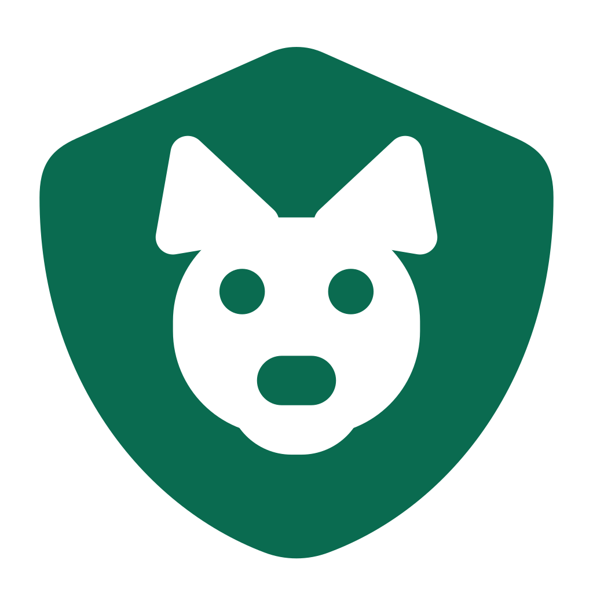

# FidelisApi

<p align="center">
  
</p>

## Equipe Driven Soft

### Integrantes

| Nome                               | RM        |
| ---------------------------------- | --------- |
| Felipe Bezerra Beatrici            | RM 564723 |
| Max Hayashi Batista                | RM 563717 |
| Henrique Cunha Torres              | RM 565119 |
| Lucas da Silva Lima                | RM 562118 |
| Yasmin Nathalin Miranda dos Santos | RM 561365 |

<hr/>

Sistema de gestão para clínicas veterinárias, construído em Spring Boot. O projeto oferece uma **API REST** completa para cadastro e consulta de clínicas, tutores, pets, veterinários, consultas, vacinas, vermifugações, exames, prescrições, medicamentos, recomendações, lembretes e histórico de peso — além de uma **camada web (Thymeleaf)** com login e telas próprias para os perfis de Clínica e Tutor.

**Repositório GitHub:** [https://github.com/Driven-Soft/FidelisApi-Java](https://github.com/Driven-Soft/FidelisApi-Java)

## Tecnologias

- Java 17
- Spring Boot 4
- Spring Data JPA / Hibernate
- Spring Security (login por formulário, senhas com BCrypt, autorização por perfil)
- Flyway (versionamento e migração do schema do banco)
- H2 Database (memória) para desenvolvimento — driver Oracle (`ojdbc11`) já disponível para produção
- Thymeleaf (telas web)
- SpringDoc OpenAPI / Swagger UI
- Bean Validation (Jakarta Validation), com validadores customizados de CPF e CNPJ
- Cache simples do Spring (`@Cacheable` / `@CacheEvict`)
- Lombok
- Estrutura em DTOs para separar entidade e API

## Funcionalidades principais

- CRUD completo dos recursos do domínio, com paginação, ordenação e busca por parâmetros
- Autenticação por sessão com dois perfis de acesso: **Clínica** e **Tutor**, cada um com suas próprias telas e permissões
- Geração automática de **lembrete** e **recomendação** ao registrar uma nova consulta
- Alerta de **retenção/churn**: identifica pets sem consulta há 90 dias ou mais
- Documentação interativa via Swagger UI e coleção Postman pronta para uso

## Estrutura do projeto

- `src/main/java/br/com/fiap/java/FidelisApi`
  - `controller/api/` - endpoints REST (`/api/v1/**`)
  - `controller/web/` - telas MVC com Thymeleaf (login, dashboard, telas de Clínica e Tutor)
  - `service/` - regras de negócio e persistência
  - `repository/` - interfaces JPA para acesso a dados
  - `entity/` - mapeamento JPA das tabelas (15 entidades, incluindo `Usuario`)
  - `dto/request/` - classes de requisição para entrada de dados
  - `dto/response/` - classes de resposta para saída de dados
  - `mapper/` - conversão entre entidades e DTOs
  - `exception/` - tratamento global de exceções (escopo restrito à API)
  - `config/` - configuração de cache, Swagger/OpenAPI e segurança
  - `validation/` - validação personalizada de CPF e CNPJ
- `src/main/resources`
  - `application.yaml` - configuração da aplicação (datasource, JPA, Flyway, Swagger, Actuator)
  - `db/migration/` - scripts versionados do Flyway (schema + dados de teste)

## Configuração

O projeto já está configurado para rodar com H2 em memória no arquivo `src/main/resources/application.yaml`, com o schema criado automaticamente pelas migrations do Flyway ao subir a aplicação.

- Banco: `jdbc:h2:mem:fidelisdb`
- Console H2: `http://localhost:8080/h2-console`
- Swagger UI: `http://localhost:8080/swagger-ui.html`
- Tela de login: `http://localhost:8080/login`

## Como executar

Para instruções detalhadas de execução, veja: **[COMO_EXECUTAR.md](documentos/requisitos/COMO_EXECUTAR.md)**

Resumidamente:

```bash
# Clonar repositório
git clone https://github.com/Driven-Soft/FidelisApi-Java.git
cd FidelisApi-Java

# Compilar e executar (Linux/macOS)
./mvnw spring-boot:run

# Compilar e executar (Windows)
.\mvnw.cmd spring-boot:run
```

Ou gerar o `jar` e executar:

```bash
./mvnw clean package
java -jar target/FidelisApi-0.0.1-SNAPSHOT.jar
```

A aplicação estará disponível em: **http://localhost:8080**

## Login e perfis de acesso

A aplicação exige login para acessar a maioria das rotas. As migrations do Flyway já criam usuários de teste:

| Perfil  | E-mail                 | Senha    |
| ------- | ---------------------- | -------- |
| Clínica | clinica@fidelis.com.br | Senha123 |
| Tutor   | tutor@fidelis.com.br   | Senha123 |

Após o login você é redirecionado para `/dashboard`. Rotas em `/clinica/**` exigem perfil Clínica e rotas em `/tutor/**` exigem perfil Tutor.

## Coleção Postman / Insomnia

Há uma coleção em `documentos/api/postman_collection.json`, cobrindo autenticação, CRUD dos recursos principais e os fluxos de negócio (geração automática de lembrete/recomendação, alerta de retenção).

- Importe `documentos/api/postman_collection.json` no Postman ou Insomnia.
- Ajuste a variável `baseUrl` para `http://localhost:8080` antes de executar as requisições.
- Autentique-se antes de chamar endpoints protegidos.

## Testes

Para executar a suíte de testes automatizados do projeto:

```bash
./mvnw test
```

Os testes cobrem mappers, services, repositórios, controllers, segurança (login/perfis/proteção de rotas) e os fluxos de negócio, e usam H2 em memória.

## Endpoints principais

As rotas da API seguem o padrão `/api/v1/{recurso}`. Exemplos:

- `GET /api/v1/pets`
- `POST /api/v1/tutores`
- `GET /api/v1/consultas`
- `POST /api/v1/vacinacoes`
- `GET /api/v1/veterinarios`
- `POST /api/v1/clinicas`
- `GET /api/v1/clinicas/{id}/retencao` - pets em risco de retenção/churn (perfil Clínica)

Leituras (`GET`) exigem apenas usuário autenticado; escritas (`POST`/`PUT`/`PATCH`/`DELETE`) exigem perfil Clínica.

## Validação

- `@Cpf` - valida CPF
- `@Cnpj` - valida CNPJ
- Campos obrigatórios e formatos de texto são validados pelo Bean Validation

## Documentação adicional

- **Como executar**: [`documentos/requisitos/COMO_EXECUTAR.md`](documentos/requisitos/COMO_EXECUTAR.md)
- **Requisitos técnicos**: [`documentos/requisitos/REQUISITOS_TECNICOS.md`](documentos/requisitos/REQUISITOS_TECNICOS.md)
- **Diagrama Entidade-Relacionamento (DER)**: [`documentos/arquitetura/DER.md`](documentos/arquitetura/DER.md)
- **Diagrama de Classes (DCE)**: [`documentos/arquitetura/DCE.md`](documentos/arquitetura/DCE.md)
- **Coleção Postman**: [`documentos/api/postman_collection.json`](documentos/api/postman_collection.json)

## Observações

- A aplicação usa H2 em memória para facilitar testes e desenvolvimento, com schema controlado por migrations Flyway versionadas em `db/migration`.
- A organização do código segue um padrão de camadas para manter separação entre API, negócio e persistência.
- O projeto está preparado para evoluir para conexão com um banco de dados real (Oracle), bastando ajustar `spring.datasource` em `application.yaml` — o driver já está incluído no `pom.xml`.
