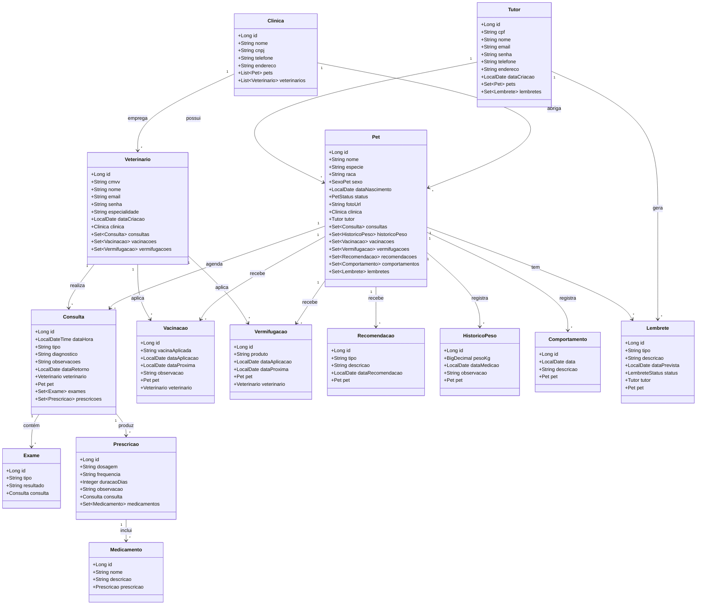

# Diagrama de Classes de Entidade

Este documento apresenta o diagrama de classes das entidades principais da aplicação FidelisApi. Ele descreve as entidades JPA e seus relacionamentos.

## Descrição do diagrama

- `Clinica` tem muitos `Pet` e muitos `Veterinario`.
- `Tutor` tem muitos `Pet` e muitos `Lembrete`.
- `Pet` é o centro do modelo e compõe consultas, vacinas, vermifugações, recomendações, comportamentos, histórico de peso e lembretes.
- `Consulta` relaciona um `Veterinario` e um `Pet`, e agrega `Exame` e `Prescricao`.
- `Prescricao` agrega vários `Medicamento`.
- `Lembrete` captura compromissos para `Tutor` e `Pet`.
- `HistoricoPeso`, `Recomendacao` e `Comportamento` guardam informações de monitoramento do `Pet`.
