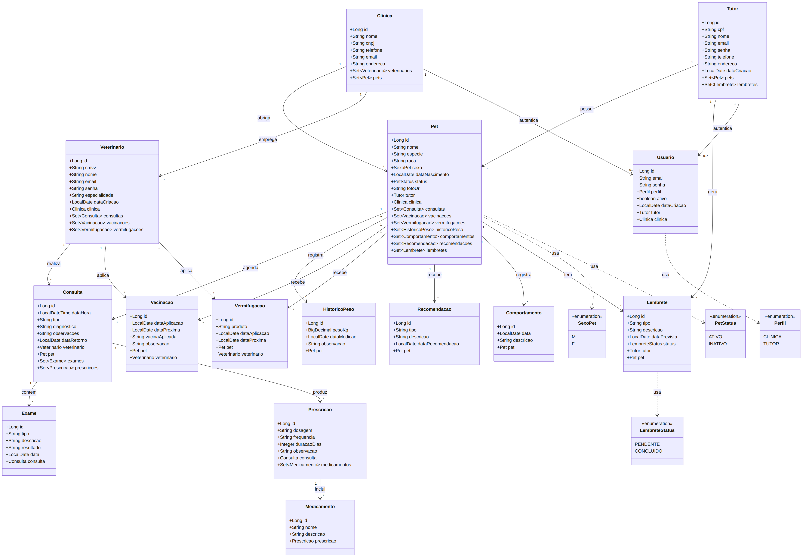
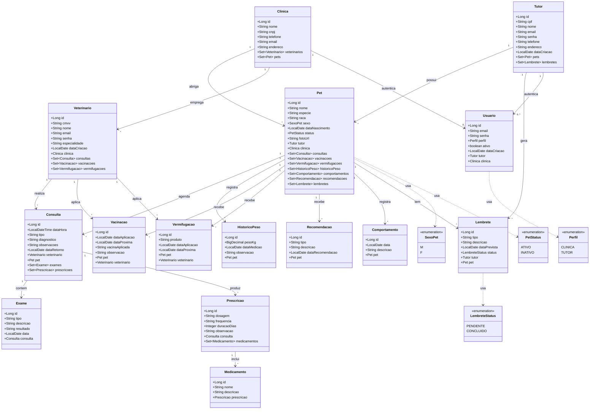

# Diagrama de Classes de Entidade (DCE)

Este documento apresenta o Diagrama de Classes de Entidade (DCE) da aplicação FidelisApi, com base nas classes JPA do pacote `entity`, seus atributos, enums e relacionamentos.

## Descrição do diagrama

- `Clinica` tem muitos `Pet` e muitos `Veterinario`, e pode ter usuários de acesso (`Usuario`) vinculados a ela.
- `Tutor` tem muitos `Pet` e muitos `Lembrete`, e também pode ter usuários de acesso vinculados.
- `Usuario` representa o login do sistema e se relaciona opcionalmente com `Tutor` **ou** `Clinica`, conforme o `Perfil` (enum `CLINICA`/`TUTOR`).
- `Pet` é o centro do modelo e compõe consultas, vacinas, vermifugações, recomendações, comportamentos, histórico de peso e lembretes. Usa os enums `SexoPet` e `PetStatus`.
- `Consulta` relaciona um `Veterinario` e um `Pet`, e agrega `Exame` e `Prescricao`.
- `Prescricao` agrega vários `Medicamento`.
- `Lembrete` captura compromissos para `Tutor` e `Pet`, com status controlado pelo enum `LembreteStatus`.
- `HistoricoPeso`, `Recomendacao` e `Comportamento` guardam informações de monitoramento do `Pet`.
