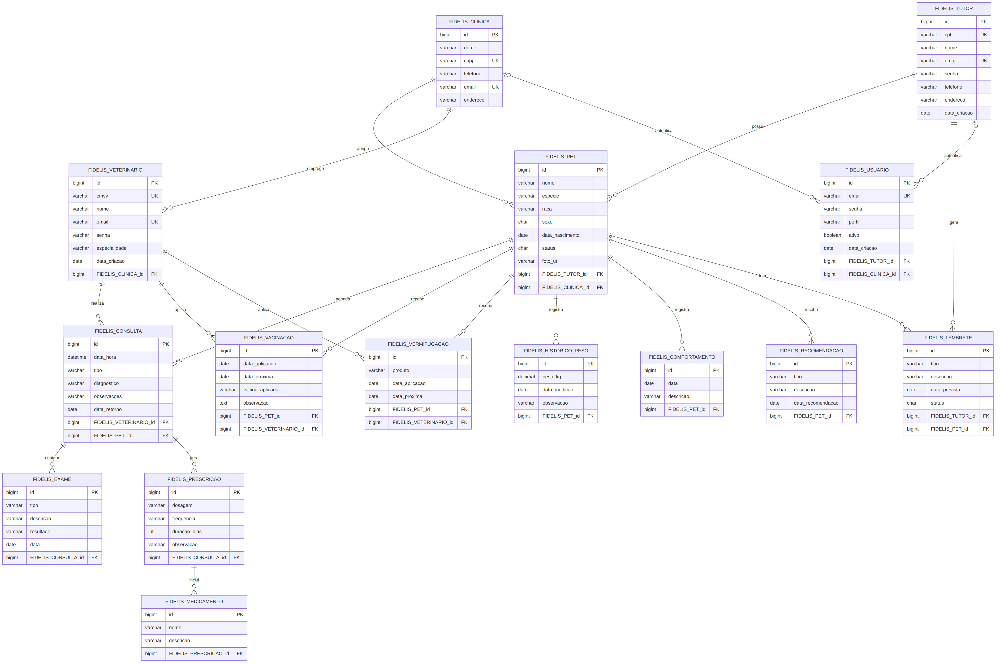
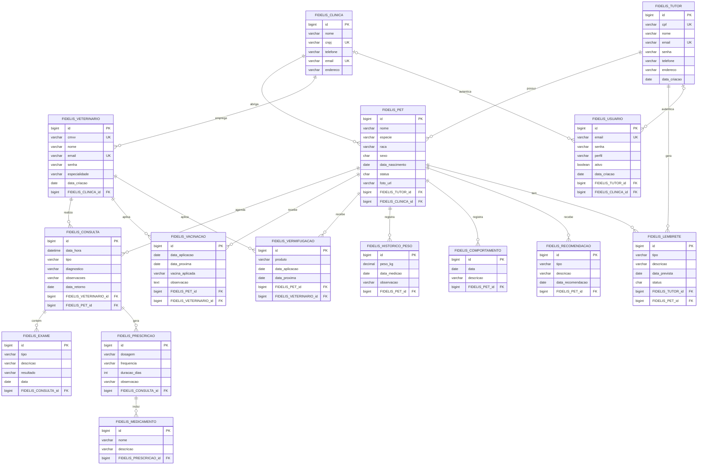

# Diagrama de Entidade-Relacionamento (DER)

Este documento apresenta o Diagrama de Entidade-Relacionamento (DER) do banco de dados da aplicação FidelisApi, com base nas entidades JPA mapeadas no código (pacote `entity`). Ele mostra as tabelas, colunas, chaves primárias (PK), chaves estrangeiras (FK), chaves únicas (UK) e a cardinalidade dos relacionamentos.

## Descrição das entidades e relacionamentos

- **FIDELIS_CLINICA**: cadastro das clínicas veterinárias. Uma clínica emprega vários `FIDELIS_VETERINARIO` e abriga vários `FIDELIS_PET`.
- **FIDELIS_TUTOR**: donos dos pets. Um tutor possui vários `FIDELIS_PET` e gera vários `FIDELIS_LEMBRETE`.
- **FIDELIS_VETERINARIO**: vinculado a uma `FIDELIS_CLINICA`; realiza consultas, aplica vacinações e vermifugações.
- **FIDELIS_USUARIO**: tabela de autenticação/login, associada opcionalmente a um `FIDELIS_TUTOR` ou a uma `FIDELIS_CLINICA` (conforme o perfil de acesso).
- **FIDELIS_PET**: entidade central do modelo. Pertence a um `FIDELIS_TUTOR` e a uma `FIDELIS_CLINICA`; concentra consultas, vacinações, vermifugações, histórico de peso, comportamentos, recomendações e lembretes.
- **FIDELIS_CONSULTA**: relaciona um `FIDELIS_VETERINARIO` e um `FIDELIS_PET`; agrega `FIDELIS_EXAME` e `FIDELIS_PRESCRICAO`.
- **FIDELIS_EXAME**: exames vinculados a uma consulta.
- **FIDELIS_PRESCRICAO**: prescrição médica de uma consulta, que agrega vários `FIDELIS_MEDICAMENTO`.
- **FIDELIS_VACINACAO** e **FIDELIS_VERMIFUGACAO**: procedimentos aplicados a um `FIDELIS_PET` por um `FIDELIS_VETERINARIO`.
- **FIDELIS_HISTORICO_PESO**, **FIDELIS_COMPORTAMENTO** e **FIDELIS_RECOMENDACAO**: registros de acompanhamento vinculados diretamente ao `FIDELIS_PET`.
- **FIDELIS_LEMBRETE**: compromissos/tarefas vinculados a um `FIDELIS_TUTOR` e a um `FIDELIS_PET`, com status controlado (`P` = pendente, `C` = concluído).

> Observação: os relacionamentos de `FIDELIS_USUARIO` com `FIDELIS_TUTOR` e `FIDELIS_CLINICA` são opcionais (colunas FK nulas), pois um usuário se autentica apenas em um dos dois perfis (`Perfil.TUTOR` ou `Perfil.CLINICA`).
